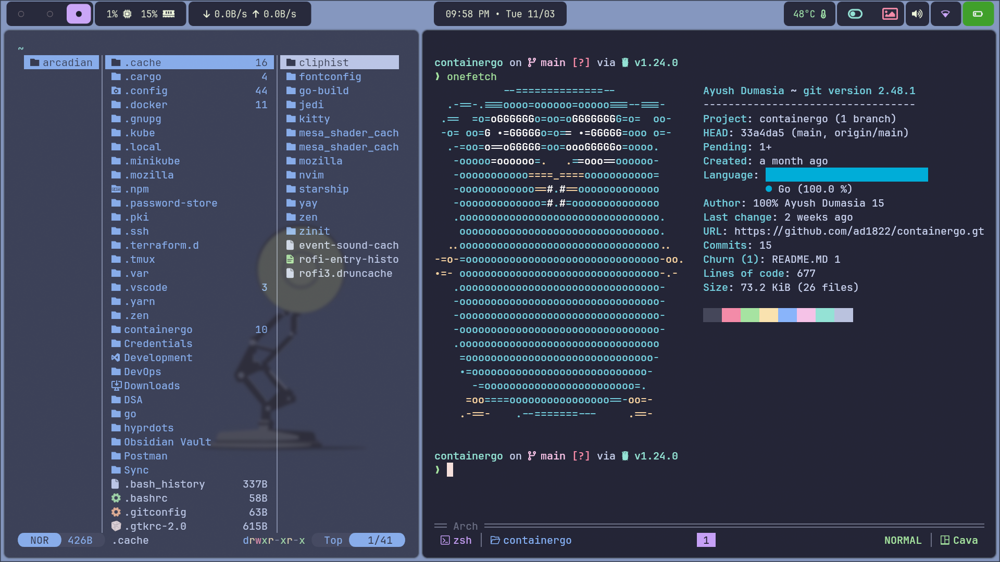
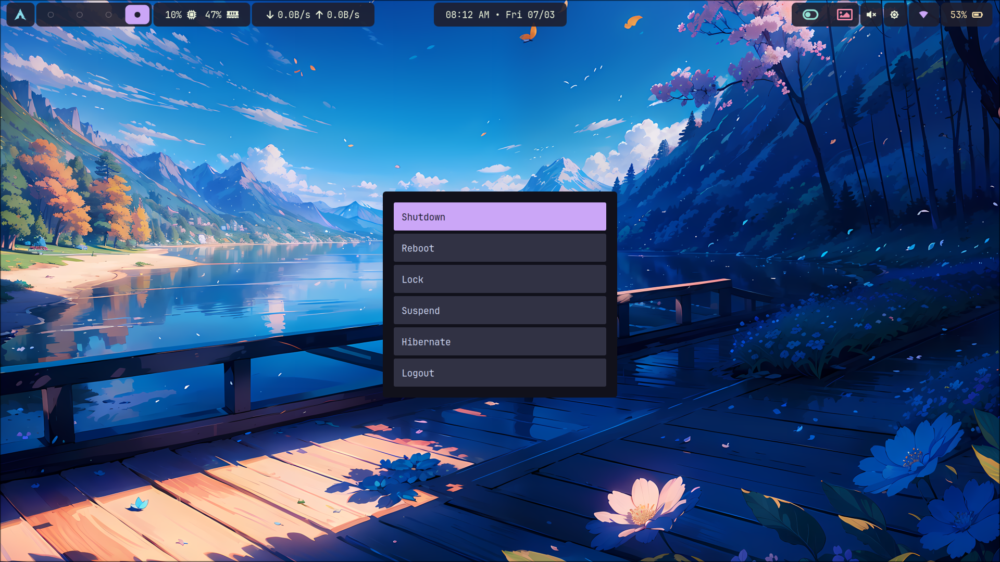
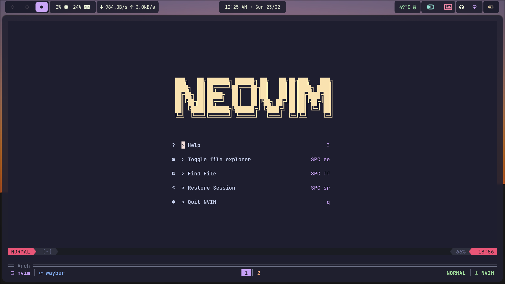
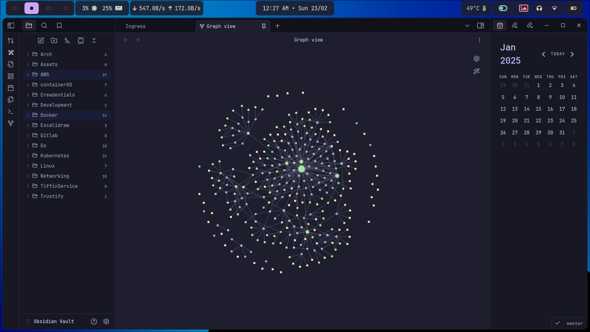

## ⭐ Don't Forget to Star!

## Wallpaper

[Wallpaper](https://drive.google.com/drive/folders/1Eog40yvrTshjDLVIETVncBKcDsvPLMIX?usp=sharing)

## File System

- **File System**: btrfs

## Boot Loader

- **Boot Loader**: GNU GRUB (Grand Unified Boot Loader)

## Login Manager & Session Manager

- **Login Manager & Session Manager**: SDDM (Simple Desktop Display Manager)

## Package Management

- **Default**: pacman
- **Others**: wget, Homebrew

## Fonts

- **Fonts**: JetBrains Mono Nerd Fonts

## Audio

- **Audio System**: Pipewire

---

### GUI Setup

- **Window Manager**: hyprland (Tiling)
- **Status Bar**: Waybar
- **Notification Manager**: Dunst
- **Browser**: Firefox
- **Image Viewer**: feh
- **Video Player**: VLC
- **Color Picker**: hyprpicker
- **Wallpaper Utility**: hyprpaper
- **Screenshot Utility**: grim & slurp
- **File Manager**: Thunar
- **App Launcher**: Rofi
- **Wi-Fi & Bluetooth Management**: Rofi

---

### CLI Setup

- **Terminal Emulator**: kitty
- **Shell**: Zsh (z-shell)
- **Terminal Prompt**: Starship / Oh My Posh
- **History Manager**: Atuin
- **Search Utility**: Fzf (Fuzzy Finder)
- **Terminal Multiplexer**: tmux
- **Trash Control**: trashy
- **Fetch Utilities**: nitch, fastfetch, cutefetch
- **Zip Management**: unzip
- **Clipboard Management**: cliphist, wl-clipboard

### TUI Setup

- **Git Management**: gitui, lazygit
- **Code Editors**: Neovim, Nano, Vim
- **Task Manager**: btop
- **File Manager**: yazi
- **Kubernetes**: k9s
- **Docker**: lazydocker

---

### CLI Alternatives

- **cd**: zoxide
- **ls**: eza / exa
- **cat**: bat
- **man**: tldr

---

### System Management

- **Network Management**: NetworkManager (nmcli), iwd (iNet Wireless Daemon)
- **Bluetooth Management**: Bluez, Bluez-utils
- **Audio Management**: pamixer, PulseAudio
- **Brightness Control**: brightnessctl
- **Power Management**: acpi
- **Media Player Control**: playerctl

---
