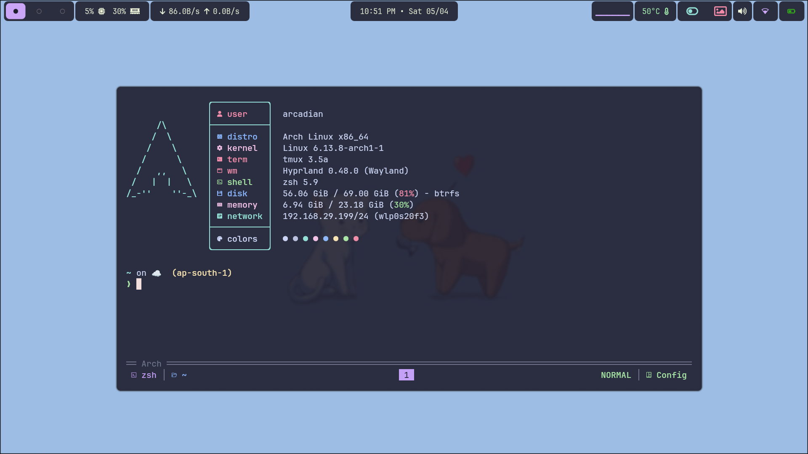
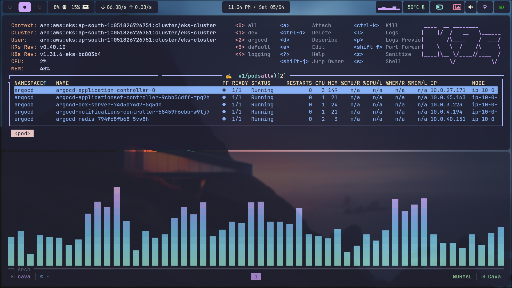
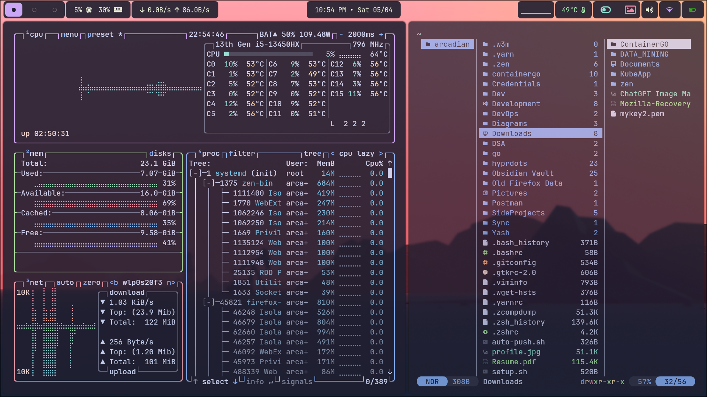
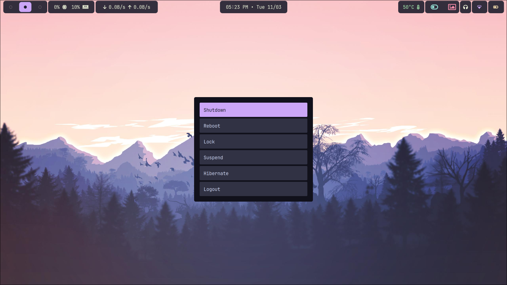
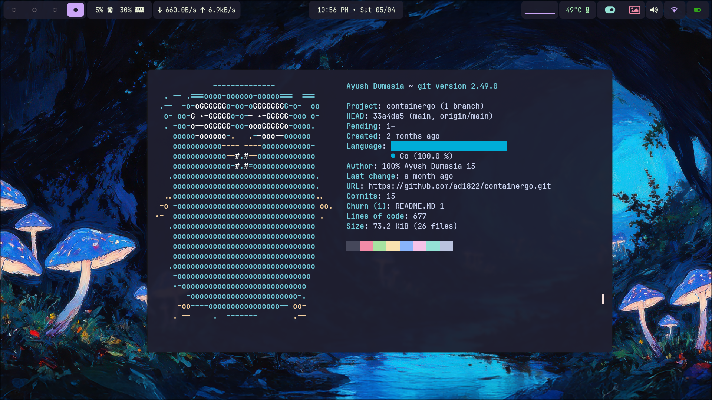
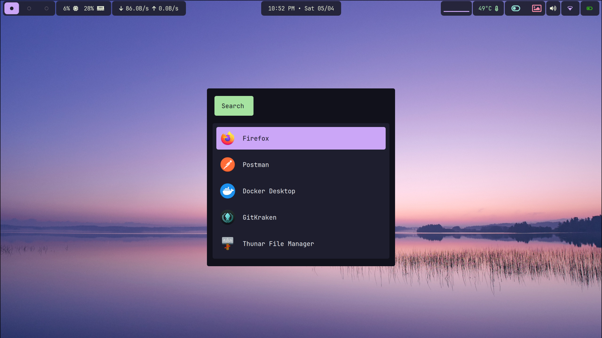

<h1 align="center">Hyprdots - Aesthetic Dotfiles for Hyprland</h1>

<p align="center">
  <a href="https://hyprland.org/"></a>
  <a href="https://github.com/Alexays/Waybar"></a>
  <a href="https://github.com/hyprwm/hyprlock"></a>
  <a href="https://www.gnu.org/software/bash/manual/zsh.html"></a>
  <a href="https://github.com/kovidgoyal/kitty"></a>
  <a href="https://github.com/lbonn/rofi"></a>
  <a href="https://github.com/sentriz/cliphist"></a>
  <a href="https://github.com/pwmt/zathura"></a>
  <a href="https://github.com/sddm/sddm"></a>
  <a href="https://github.com/dunst-project/dunst"></a>
  <a href="https://github.com/tmux/tmux/"></a>
</p>

<p align="center">
  <a href="https://github.com/ad1822/hyprdots/stars">
    
  </a>
  <a href="https://github.com/ad1822/hyprdots/forks">
    
  </a>
  <!-- <a href="https://github.com/ad1822/hyprdots/network/members">
    
  </a> -->
  <a href="https://github.com/your-username/hyprdots/commits/main">
    
  </a>
</p>

<!-- ##### Home: -->



<!-- ##### K9s and Cava: -->



<!-- ##### Yazi and Btop: -->



<!-- ##### Powermenu: -->



<!-- ##### GoLang Showcase : -->



<!-- ##### Launcher: -->



## Wallpaper

[Wallpaper](https://drive.google.com/drive/folders/1Eog40yvrTshjDLVIETVncBKcDsvPLMIX?usp=sharing)
Here’s an improved version of your README **"Quick Installation"** section, with clearer language, formatting, and professionalism while keeping your unique style:

---

## 🚀 Quick Installation Guide

### 📦 Programs Included

- **Window Manager**: Hyprland (Tiling)
- **Status Bar**: Waybar
- **Notification Manager**: Dunst
- **Browser**: Zen
- **Color Picker**: hyprpicker
- **Wallpaper Utility**: hyprpaper
- **Screenshot Utility**: grim + slurp
- **App Launcher**: Rofi
- **Terminal Emulator**: kitty
- **Shell**: Zsh
- **Media Controls**: playerctl
- **Power Management**: acpi
- **Brightness Control**: brightnessctl
- **Audio Management**: pamixer, PulseAudio
- **Network Management**: NetworkManager (nmcli), iwd (iNet Wireless Daemon)

> ℹ️ **For more detailed guidance**, check out [this](./Resources.md)

---

## 🛠️ Installation Steps

1. **Clone the repository** to your home directory like `~` or `/home/username` :

   ```sh
   git clone https://github.com/ad1822/hyprdots ~/hyprdots
   ```

2. **Navigate to the cloned directory**:

   ```sh
   cd ~/hyprdots
   ```

3. **Run the setup script**:

   ```sh
   sudo bash ./setup.sh
   ```

4. **GTK Theme Setup**:

- [Catppuccin Gtk theme](https://github.com/catppuccin/gtk/releases)

- I use [`ngw-look`](https://github.com/nwg-piotr/nwg-look) to configure GTK themes and styles.

---

## ⚠️ Important Notice (Read Before Running Setup)

> ### **Warning:**
>
> This setup script will **move your existing config files** (e.g., for Waybar, Kitty, Hyprland, etc.) to a backup folder at `~/.config_backup`. Then, it will copy the new configs from this repo into your `~/.config` directory.
>
> ### What this means:
>
> - Your current setup will be **replaced**.
> - If you have customizations you care about, **back them up manually** or review the script before running.
> - Fonts and themes will be installed system-wide in your `~/.local/share/fonts` directory.

---
